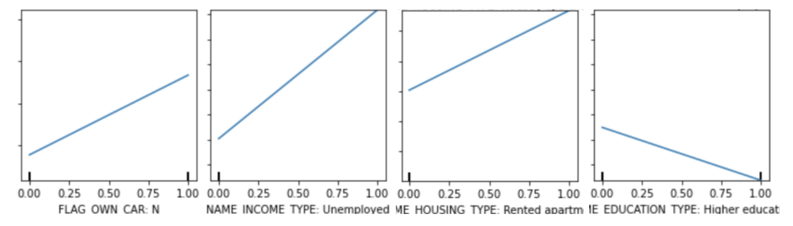
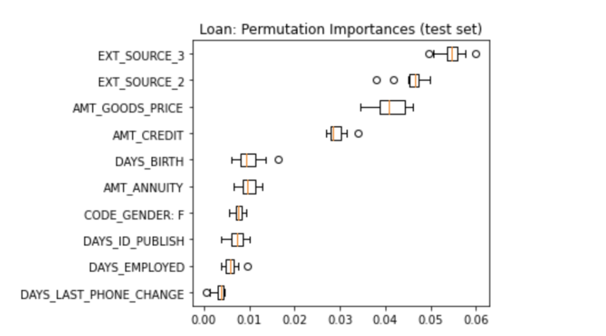
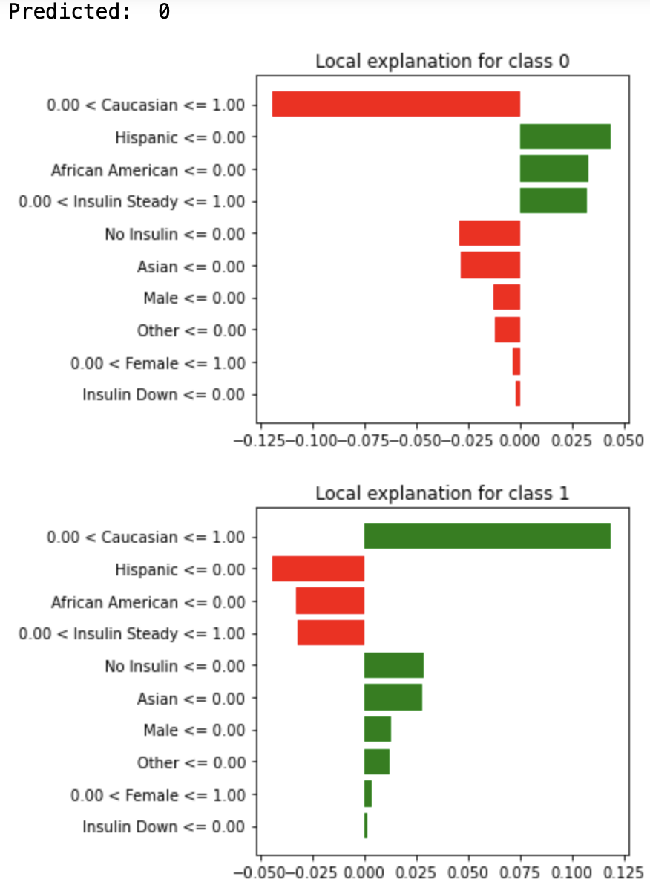
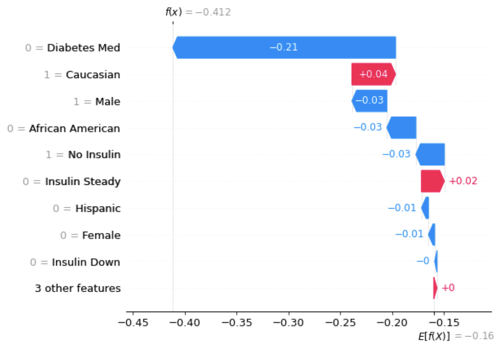
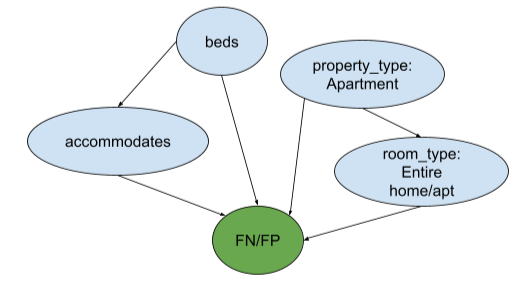
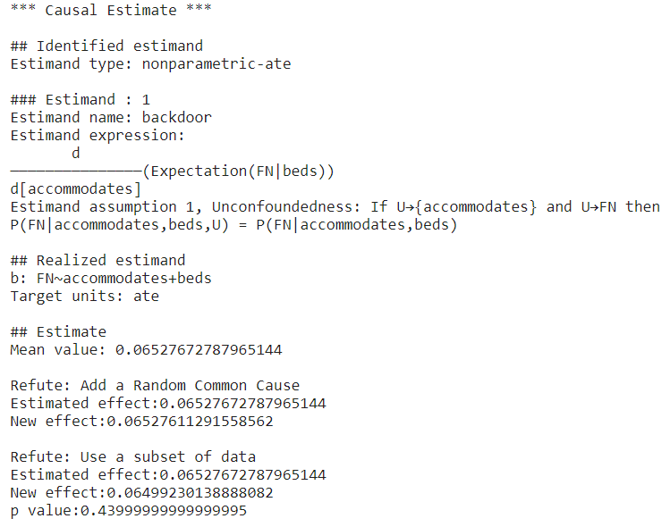
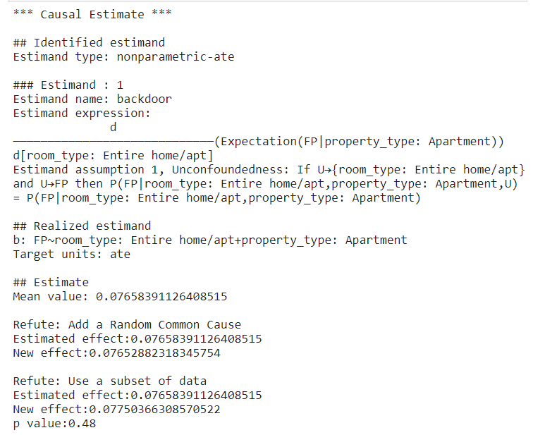
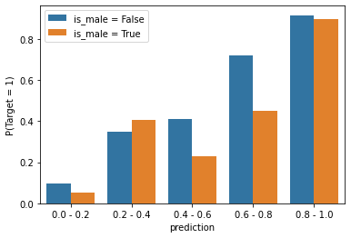

## Welcome to DSC180B Section B06's Explainable AI Webpage!

### Authors

- [Jerry (Yung-Chieh) Chan](https://github.com/JerryYC)
- [Apoorv Pochiraju](https://github.com/apochira)
- [Zhendong Wang](https://github.com/zhw005)
- [Yujie Zhang](https://github.com/yujiezhang0914)

## 1. Introduction - Assess the Fairness and reasoning of Black Box Model Outcomes using Explainable AI 

Nowadays, the algorithmic decision-making system has been very common in people’s daily lives. Gradually, some algorithms become too complex for humans to interpret, such as some black-box machine learning models and deep neural networks. 

In order to assess the fairness of the models and make them better tools for different parties, we need explainable AI (XAI) to uncover the reasoning behind the predictions made by those black-box models. 

In the project, we are focusing on using different techniques from causal inferences and XAI to interpret various classification models across various domains. In particular, we are interested in three domains - healthcare, finance, and the housing market. Within each domain, we are going to train four binary classification models first, and we have four goals in general: 

1) Explaining black-box models both globally and locally with various XAI methods;

2) Assessing the fairness of each learning algorithm with regard to different sensitive attributes;
 
3) Generating recourse for individuals - a set of minimal actions to change the prediction of those black-box models;
 
4) Evaluating the explanations from those XAI methods using domain knowledge.

## 2. Datasets in Three Domains

In our project, we use datasets from three domains: Healthcare, Finance, and Housing Market.

### Health Care

We choose healthcare as one of the domains because it is sensitive and assessing fairness of decision algorithms on this domain is important. For the healthcare domain, we will use the data on hospital readmission for diabetes patients obtained from Kaggle. The data was collected for the Hospital Readmission Reduction Program operated by Medicare & Medicaid Services and indicates whether diabetic patients were readmitted to the hospital and whether it was within 30 days or after beyond 30 days. This dataset contains records for 101,766 patients and includes attributes for each patient such as race, age, gender, insulin levels, type of admission, and other specific information about medical history. For this dataset, we will predict whether the patient will be readmitted.

[LINK to Health Care Dataset](https://www.kaggle.com/iabhishekofficial/prediction-on-hospital-readmission)

### Finance

We choose finance domain because our life is filled with topics related to finance and money, so it is important and interesting to find out the reasoning behind machine learning model decisions in this domain. For the finance domain, we will use the loan defaulter dataset obtained from Kaggle. The loan defaulter dataset consists of information such as gender and income of 307,511 applicants. For this dataset, we will predict whether an applicant will be a defaulter.

[LINK to Finance Dataset](https://www.kaggle.com/gauravduttakiit/loan-defaulter)

### Housing

We choose the housing market domain because housing is an essential element in everyone's life as well. For the housing market domain, we will use the Airbnb dataset obtained from Kaggle. The Airbnb dataset consists of basic information such as name and location for 3,818 Airbnb properties. For this dataset, we will predict the class that the price of an Airbnb property falls into.

[LINK to Housing Dataset](https://www.kaggle.com/airbnb/seattle?select=listings.csv)

## 3. Methods of XAI

We selected four popular machine learning models that's often used in tabular data classification. Our model selection covers classic machine learning model, ensemble model, and deep learning model. Following is a breif introduction to those models. Since this project focuses on model explanation, we will skip the model training details here.

* SVM: Support vector machine is a supervise learning method effective in high dimensional spaces. It project datapoints to high dimensional space and seperate them with a hyperplane.
* LGBM: LightGBM is an ensemble model with gradient boosted decision trees.
* XGBoost: Similar as LGBM, extreme Gradient Boosting is an implementation of gradient boosted decision trees with more regularized parallel decision trees.
* TabNet: TabNet is an deep tabular data learning architecture based on attentive transformer.

### Global Explanation
Global methods describe the average behavior of a machine learning model. In this project, we use two global explanation methods: partial dependence plot and Permutation Feature Importance.

The **Partial Dependence Plot (PDP)** works by marginalizing the machine learning model output over the distribution of the features in set C so that the function shows the relationship between the features in set S we are interested in and the predicted outcome. In the case that features are uncorrelated, a PDP shows how the average prediction in the dataset changes when a feature changes. 

The **Permutation Feature Importance** calculates the feature importance by permuting the feature in the dataset. A feature is important if the error of a model increases significantly after permuting the feature. A feature is not important if the error of a model does not change after shuffling the feature values. The Permutation Feature Importance method takes into account all interactions with other features by destroying the interaction effects with other features when permuting the feature. 

--> Click to learn more about PDP and Permutation Feature Importance

 
 
<ul><li>Partial Dependence Plot: The PDP works by marginalizing the machine learning model output over the distribution of the features in set C, so that the function shows the relationship between the features in set S we are interested in and the predicted outcome. Since the more important the feature is the more varied a PDP is, the numerical feature importance can be defined as the deviation of each unique feature value from the average curve. For categorical features, the importance is defined as the range of the PDP values for the unique categories divided by four, which is the range rule. The PDP can be estimated by calculating averages in the training data. An assumption of the PDP is that the features in set C are not correlated with the features in set S. And the PDP only has a causal interpretation when the features are independent of each other. The PDP is easy to implement and compute. It also has a clear interpretation: in the case that features are uncorrelated, it shows how the average prediction in the dataset changes when a feature changes. </li>

 <li>Permutation Feature Importance: A feature is important if the error of a model increases significantly after permuting the feature. A feature is not important if the error of a model does not change after shuffling the feature values. The general algorithm to calculate permutation feature importance is as follows: 
1. Calculate the original model error.
2. For each feature i, 
- Generate a new feature matrix X by shuffling the values in feature i.
- Calculate the error after the permutation.
- Calculate the difference FI between the original error and the error after the permutation.
3. Sort features by the difference in descending order.
The advantage of this method is that it takes into account all interactions with other features because it destroys the interaction effects with other features when permuting the feature. Also, it is a straightforward method since it does not require retraining the model. </li></ul>

### Local Explanation
Local interpretation methods explain individual predictions. In this project, we use two local explanation methods: Local Interpretable Model-agnostic Explanations (LIME) and Shapley Values.

The **Local Interpretable Model-agnostic Explanations (LIME)** tests what happens to the model output when we give variations of the model input data. LIME trains an interpretable model such as a decision tree on the perturbed data, which is a good approximation of the black box model predictions locally.  

The **Shapley Values** calculates the average marginal contribution across all possible coalitions. A feature is important if the error of a model increases significantly after permuting the feature. The sum of Shapley values for all features yields the difference between the actual prediction of a single instance and the average prediction. In other words, if we estimate Shapley values for all features, we will get a complete distribution of actual prediction minus the average prediction among the feature values. 

--> Click to learn more about LIME and Shapley Values

 
 
 <ul><li>LIME: To generate LIME, the first step is to select instance x that we want to get an explanation for. Then we perturb the dataset and get the black box model predictions for these new points. Then we weight the new samples according to their proximity to x. Next we train a weighted interpretable model on the perturbed dataset. Finally we generate explanations by interpreting the interpretable model. 		
For tabular data, LIME samples are taken in a problematic way: from the training data’s mass center. However, this way increases the chance of getting different results for some of the sample predictions compared to the point of interest. Therefore, LIME can learn some explanations. One advantage of LIME is that we can use the same interpretable model to generate local explanations for different black box models. We can evaluate LIME’s reliability using the fidelity measure by measuring how well a local model approximates the black box predictions. And LIME is more suitable to generate explanations for a lay person because the interpretable models make short human-friendly explanations.</li>

<li>Shapley Values: Computing the exact Shapley value could be computationally expensive most of the time as the computation time increases exponentially with the number of features, so estimating the Shapley value is necessary. Advantages of Shapley Values are that it is the only explanation method with a solid theory, and it allows comparing a prediction with the average prediction of either an entire dataset or a subset of the dataset. </li></ul>
 

### Counterfactual Explanations
A counterfactual explanation describes a causal situation in the form of “If X had not occurred, Y would not have occurred.” It's aim to provide percise actions to achieve a desired outcome. For example, if someone was denied for a loan application by some black-box machine learning algorithm, counterfactual explanation can provide them actions they can do to increase their chance of getting the loan. A good counterfactual explanation method should provide multiple, diverse, and realistic counterfactual explanations that produce the predefined prediction as closely as possible. In our project, we are using the state-of-the-art XAI method LEWIS to generate recourses.

[Click here to learn more about LEWIS](https://arxiv.org/pdf/2103.11972.pdf)

### Explaining False Positive (FP) and False Negative (FN) Predictions
In this section, we are interested in explaining both false positive and false negative predictions made by different black-box models. In other words, we would like to explore reasons why a particular model predicts positive outcomes whereas the true label is negative and why a model predicts negative outcomes whereas the true label is positive. To analyze FP and FN predictions, we will be using causal inferences in general, and the details of each step are described below.

--> Click to learn more about Causal Inference

 
 <ul><li>Changing Labels: To begin with, we are going to change the label of a dataset to denote whether a prediction is FP or FN. For example, in the original Airbnb dataset, the label encodes whether a price of a listing is above or below average with values 0 and 1. In the case of FP analysis, we will be changing the label to 0 and 1, where value 1 denotes that a prediction of the model is FP and value 0 denotes that a prediction of the model is not FP.</li>
  
  <li>Modeling: To do causal inference, we first need to model the assumptions and create causal graphs that explain the causal relationships between variables, including the treatment and outcome that we are interested in.</li>
 
  <li>Identification: After reasoning about the problem with causal graphs, we need to identify an estimable quantity that represents P(Y|do(T)) generated by the intervention graph. Also, the desired quantity should be calculated using statistical observations alone. We call it an identification step.</li>
 
   <li>Estimation: After identifying the estimable quantity, we use the observed data to compute the target probability expression. For binary treatments, the causal effect is E[Y|T = 1, W = w] - E[Y|T = 0, W = w]. The ultimate goal of estimation is to estimate p(Y|T=t) when all confounders W are kept constant.</li>
  
   <li>Robustness Check: After conducting estimation, we need to test the robustness of the estimate to the violation of assumptions. One example is using a Placebo Treatment Refuter by replacing the treatment variable with a randomly-generated variable and seeing if the estimate is zero to check if the treatment really causes the outcome. To check the sensitivity of an estimate to a new confounder, we can use an Unobserved Confounder Refuter by simulating a confounder based on a given correlation with both treatment and outcome and rerun the analysis to see if the direction of the estimate flips.
</li></ul>

### Fairness Analysis
We conduct some common fairness tests on the models trained on the loan dataset and the healthcare dataset. We pick out sensitive attributes that should be independent of the target variable base on human knowledge. For the loan dataset, the sensitive variable that we chose is gender, and for the healthcare dataset, the sensitive attribute is race.
For each classification model, we evaluated the fairness based on four definitions: Group Fairness, Predictive Parity, Matching conditional frequencies, and Causal discrimination. They evaluate the fairness of a model based on different definitions. 

--> Click to learn more about the four fairness definitions

 
 
<ul><li>Group Fairness: A fair model’s prediction should be independent of the sensitive attribute. Therefore, it should have the same probability of giving a positive prediction for individuals of different protected classes. In this test we check if  P(Y = 1|S = si) = P(Y = 1|S = sj). Notice that this test does not require the actual value of the target variable. In other words, the test is independent of whether the model makes the correct predictions.</li>

 <li>Predictive Parity: This test measures the model’s predictive power on different groups of the protected class. The probability of the model making the correct prediction should be the same across different groups. In this test, we check if the true positive rates are the same among groups: P(T = 1|Y = 1, S= si) = P(T = 1|Y = 1, S = sj). The method can be also be applied with different prediction evaluation metrics.</li>

 <li>Matching conditional frequencies: This test is similar to the predictive parity test, except we consider the distribution of predicted probabilities rather than the binarized prediction. We binned the predicted probabilities and compare the frequencies of each bin across different groups. For each bin, We check if P(T = 1|Y  ∈  bink, S= si) = P(T = 1|Y  ∈ bink, S = sj)</li>

 <li>Causal discrimination: The model is counterfactually fair if its prediction is independent of the change of sensitive variable. We conduct the test by flipping or randomly shuffling the sensitive attribute of the test set and checking if the prediction remains the same.</li></ul>

## 4. Results

### Global Explanation
In this section, we will present several interesting examples of PDP and Permutation Feature Importance. Below are the PDPs of ‘FLAG_OWN_CAR: N’, ‘NAME_INCOME_TYPE: Unemployed’, ‘NAME_HOUSING_TYPE: Rented apartment’, ‘NAME_EDUCATION_TYPE: Higher Education’ from the loan dataset that uses the XGBoost model. 

Based on the partial dependence plots, we can tell that when the value of ‘FLAG_OWN_CAR: N’, ‘NAME_INCOME_TYPE: Unemployed’, and ‘NAME_HOUSING_TYPE: Rented apartment’ changes from 0 to 1, the average prediction in the dataset increases. And when the value of ‘NAME_EDUCATION_TYPE: Higher Education’changes from 0 to 1, the average prediction decreases. Combining the domain knowledge, we can tell that the four plots show an accurate relationship: in reality, a person is more likely to be a defaulter if the person doesn’t have a car, doesn’t have a job, or is renting apartments. And a person with higher education is more likely to get a loan. 

The graph below shows the ten most important features generated by permutation feature importance on the test set of loan data that uses the XGBoost Model. 

According to the permutation importance graph, we can see that except for the features that are determined by an external source (‘EXT_SOURCE_3’ and ‘EXT_SOURCE_2’), ‘AMT_GOODS_PRICE’ and ‘AMT_CREDIT’ are the two most important features. So we can see that the price of the goods for which the loan is given and the credit amount of the loan are very important in a loan application. ‘DAYS_BIRTH’, which represents the applicant’s age in days at the time of application is also important. To evaluate the feature importances using domain knowledge, we can tell that the ranking of features based on their importance is quite accurate as attributes like the amount of money a person is applying for, the age of the applicant, and the applicant's days of employment are definitely heavily considered during the loan application process.

### Local Explanation
In this section, we will present examples of local explanations for an individual in the healthcare dataset. 

The graph below shows the LIME for one individual in the test set of the healthcare dataset. This individual is a Caucasian female with steady insulin who is taking diabetes medications. The predicted outcome for this individual is 0, which means that this individual is predicted to not be readmitted to the hospital. According to the graph, we can tell that not being a Hispanic contributes the most to being predicted to class 0, then is not being an African American. 

The graph below shows the Shapley values for the same individual.

From the graph above, we can see that the average prediction is -0.16, and the actual prediction for this individual is -0.412. And not on Diabetes Med has the most effect of dragging the prediction closer to -0.412. Being a Caucasian has the most effect of dragging the prediction the most closer to -0.16.

### Counterfactual
Use the same data instance to generate counterfactual result

### False Positive (FP) and False Negative (FN) Explanations
We analyzed both false positives and false negatives predictions of multiple black-box models on various datasets. In this section, we will be using the results found in the Airbnb dataset as an example of our analysis. 

Using the domain knowledge, we constructed a simple causal graph below with several features of interest.

#### FN Example
Here is an example of how the feature “accommodates” causes the SVC model to predict false negatives. 

First, the DoWhy causal model sets the feature “accommodates” to be the treatment and identifies the confounder “beds” using the backdoor criterion. Then, the DoWhy causal model simulates the randomized experiment by adjusting the influence of some confounding variables Z, and it is “beds” in this case. After identifying the estimand, the DoWhy causal model estimates the estimand using the Average Treatment Effect (ATE), and the result is about 0.065. Thus, having higher maximum capacity in a listing increases the chance of the SVC predicting FN. To validate the result, we use two refutation tests. The first one is called Random Common Cause which adds randomly drawn covariates to data and re-runs the analysis to see if the causal estimate changes or not. If our assumption was originally correct then the causal estimate shouldn’t change by much. In this case, the estimated effect and the new effect are about the same. The second test is called Data Subset Refuter which creates subsets of the data(similar to cross-validation) and checks whether the causal estimates vary across subsets. If our assumptions were correct there shouldn’t be much variation. In our example, the estimated effect and the new effect is not significantly different according to the p value. We can see that our estimate passes all refutation tests. This does not prove its correctness, but it increases confidence in the estimate.

In conclusion, after the causal inference, we can say that having a higher maximum capacity in a listing increases the chance of the SVC predicting FN. This is intuitive because a listing with a higher maximum capacity is more likely to be expensive in reality, so the model will give FN predictions if the model fails to capture this positive correlation.

#### FP Example
Here is another example of how room type causes the LGBM model to predict false positives.

The same procedure used to generate causal inference for the previous example applies here as well. The DoWhy model first sets the “room_type” to be the treatment and identifies the cofounder “property_type” and estimand it tries to estimate. Then, it estimates the ATE to be around 0.077. So, the predictor tends to give FP predictions if the room type is the entire home/apt. The estimate also passes all refutation tests. Again, this does not prove its correctness, but it increases confidence in the estimate. The result makes sense because if a model puts too much weight on the room type, it will predict the higher prices for listings with an entire place, while this is not always the case in reality. Sometimes a shared place could be more expensive than an entire apartment depending on the location and other factors.

### Fairness Analysis
In this section, we run all the fairness evaluation methods on different datasets and models. We select some interesting result for each method and the presented in the followings. We assume the dataset represent the actual population.

#### Group Fairness

#### Predictive Parity

#### Conditional Frequencies
- Dataset: Airbnb
- Model: XGboost
- Sensitive variable: Randomly generated gender column

The gender attribute of each instance are randomly generated. Therefore it's not correlated with the target at all. The correlation coefficient of the two variable is 0.02. 

Each bar of the figure represent the true probability of an instance being positive given that the model prediction is within a certain range. From the graph, we can see that when model's prediction is within the 0.4\~0.6 bin or the 0.6\~0.8 bin, male airbnb host has a significantly lower true probability of being in the positive class. In other words, the model overpredicted on instances with male owner. Hense, the model is unfair.

#### Causal Discrimination
- Dataset: Loan
- Model: TabNet
- Sensitive variable: Gender (`CODE_GENDER`)

In this experiment, we flip the gender of all the instance and measure the average prediction change for each gender. After only flipping the gender feature, **21.0% of the instances have their prediction changed**. By changing gender of the loan borrower from female to male increases the prediction by 11.2% on average, and by changing the gender from male to female decreases the prediction by 9.6% on average. The result indicates that the model is unfair and rely on the gender to make it's prediction. The model is biased toward giving male loan borrower a higher prediction of default probability.

### Explanation Comparison
Compare explanation generated from different model and different XAI methods.

## 5. Code
[Click here to see code for this project](https://github.com/zhw005/DSC180B-Project)

## 6. Reference

- Molnar, C. (2021, November 11). Interpretable machine learning. 9.5 Shapley Values. Retrieved December 2, 2021, from https://christophm.github.io/interpretable-ml-book/shapley.html.

